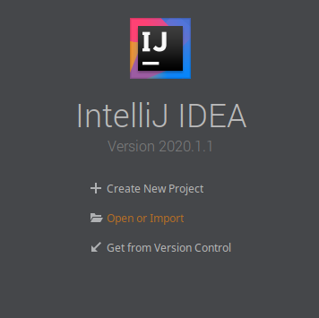
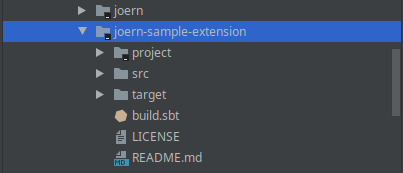
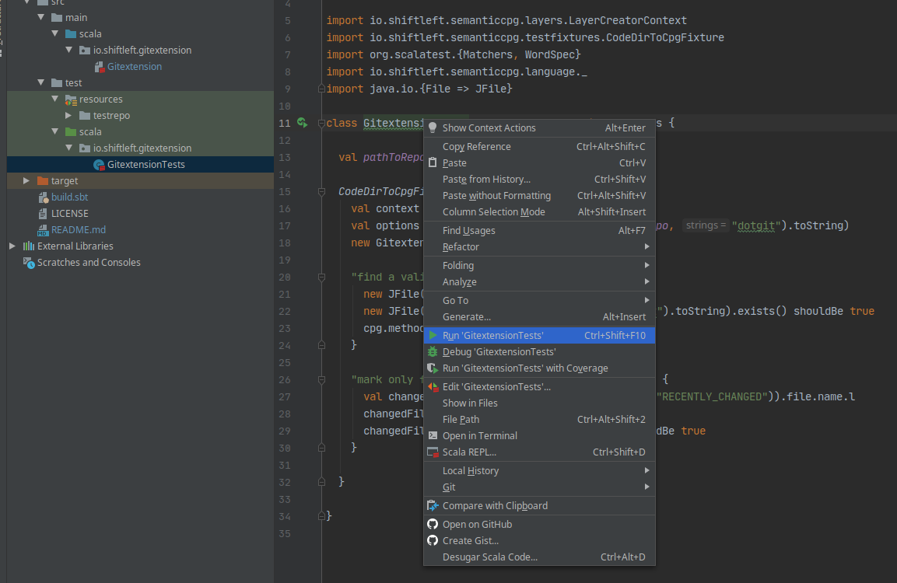

Joern Git Extension
===================

A sample extension for Joern/Ocular that determines recently edited
files from a git repository and tags the corresponding file nodes in
the Code Property Graph. Its main purpose it to show how Joern can be
used as a platform for code analysis.

Intro
-----

Joern/Ocular provide a runtime extension mechanism that allows you to
develop custom analyzers on top of the platform. Extensions are
programs for the JVM that can be written in Java, Scala or
Kotlin. They can access the code property graph via a query language
and create new nodes, edges and properties via the
DiffGraph API. Moreover, they can interface with Java libraries to, for
example, to access the network or file system.

The Joern Git Extension is a minimal example of an extension. It reads
a git history using a Java library and tags nodes of functions that
have recently been modified. The main purpose of this extension is to
provide an example that shows how Joern extensions can be developed
and tested in the IntelliJ IDE. The extension is written in Scala and
makes use of the Java library jgit.

Dependencies
------------
- the Scala Build Tool (SBT) - any version

Building
--------

```bash
	sbt stage
```

Installation
------------
Copy the resulting JAR file to Joern's `lib` directory. Next time you
start joern, type `run`. Your extension should be listed.


```bash
   cp target/universal/stage/lib/io.shiftleft.joern-sample-extension-*.jar $joern_install/lib/
   cp target/universal/stage/lib/org.eclipse.jgit.org.eclipse.jgit* $joern_install/lib/
```

where `$joern_install` is the directory where you installed Joern/Ocular.

Running
-------

On the joern shell, type `run.gitextension`. You can also
inspect/modify options passed to the plugin by typing
`opts.gitextension.<TAB>`.


Importing into IntelliJ and running tests
-----------------------------------------

Joern Extensions can be developed in an IDE and the process of
importing an extension may differ slightly from IDE to IDE. The
following instructions are for IntelliJ.







